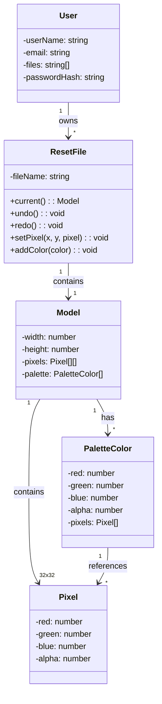
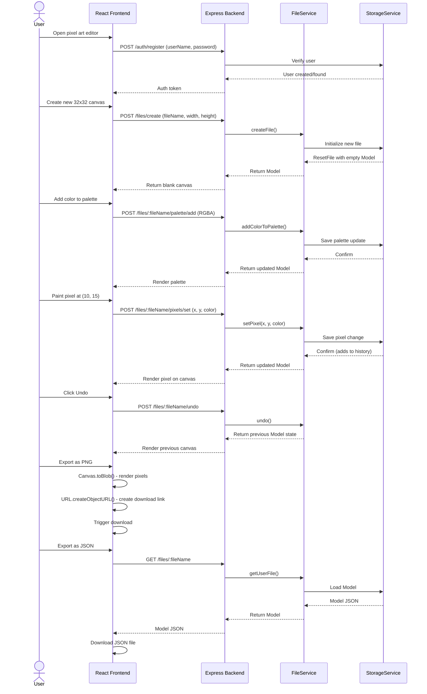

# Architecture Diagrams

## 1. Class Diagram - Data Models

### Description
- **User**: Represents a registered user with authentication credentials
- **ResetFile**: Container for a pixel art file with undo/redo history
- **Model**: Core data structure containing canvas dimensions and pixel grid
- **Palette**: Collection of colors available for the user to paint with
- **Pixel**: Individual RGBA color value in the canvas grid

---

## 2. Sequence Diagram - User Workflow

### Key Flows
1. **Authentication**: Users register/login before accessing the editor
2. **File Creation**: Initialize new 32x32 canvas with empty pixel grid
3. **Palette Management**: Add colors to create custom painting palette
4. **Pixel Painting**: Each pixel update triggers backend save and history tracking
5. **Undo/Redo**: Navigate through action history without network calls (local)
6. **Export**: PNG export client-side; JSON export retrieves server data

### REST API Endpoints

**Authentication (2 endpoints)**
- `POST /auth/register` - Create new user account
- `POST /auth/login` - User authentication and token generation

**File Operations (5 endpoints)**
- `POST /files/create` - Create new pixel art file
- `GET /files/:fileName` - Retrieve file data and current model
- `GET /files/list` - List all files for authenticated user
- `DELETE /files/:fileName` - Delete file and all associated data
- `GET /files/:fileName/export` - Export file as JSON

**Palette Operations (2 endpoints)**
- `POST /files/:fileName/palette/add` - Add new color to palette (RGBA)
- `DELETE /files/:fileName/palette/:index` - Remove color at index

**Pixel Operations (2 endpoints)**
- `POST /files/:fileName/pixels/set` - Paint single pixel at coordinates
- `POST /files/:fileName/pixels/fill` - Fill rectangular region with color

**Undo/Redo (4 endpoints)**
- `POST /files/:fileName/undo` - Revert to previous state
- `POST /files/:fileName/redo` - Advance to next state
- `GET /files/:fileName/canUndo` - Check if undo available
- `GET /files/:fileName/canRedo` - Check if redo available

---

## Design Decisions

1. **Layered Architecture**: Clean separation between frontend UI, backend business logic, and data persistence
2. **Service Pattern**: FileService and UserService provide abstraction and reusability
3. **Storage Abstraction**: StorageService enables switching between JSON and MongoDB without code changes
4. **Undo/Redo History**: Maintained in ResetFile with stack-based approach (50+ actions)
5. **Client-Side Export**: PNG export done entirely in browser to reduce server load
6. **RGBA Color Model**: Full color depth with alpha transparency support
